

# MeowList

### *8-Bit Retro Todo App with Adorable Pixel Cat*

[About](#about) • [Features](#features) • [Screenshots](#screenshots) • [Tech Stack](#tech-stack) • [Contact](#contact)

---

## About

A delightful task management application that combines nostalgic 8-bit aesthetics with modern functionality. MeowList brings back the charm of retro gaming while helping you stay organized with an adorable pixel cat companion that walks across your screen!

<table>
<tr>
<td width="33%" align="center">

Pixel-perfect 8-bit art  
Classic retro UI  
NES.css framework  
Nostalgic experience

</td>
<td width="33%" align="center">

Built with React 18  
TypeScript & Vite  
Optimized performance  
Production-ready code

</td>
<td width="33%" align="center">

Pixel cat companion  
Drag & drop tasks  
Discord integration  
Cross-platform support

</td>
</tr>
</table>

**What makes this special:**  
Unlike boring todo apps, MeowList transforms task management into a fun, nostalgic experience. Your pixel cat companion reacts to your productivity, walks across the screen, and keeps you company while you work. With 9 color themes, 9 languages, and Discord integration, it's the perfect blend of retro charm and modern features.

---

## Features

<table>
<tr>
<td width="33%" valign="top">

- Unlimited folders
- Drag & drop tasks
- Quick edit mode
- Completion tracking
- Progress indicators
- Folder organization
- Auto-save

</td>
<td width="33%" valign="top">

- **9 Cat Skins:**
- 🤍 White Cat
- 🖤 Black Cat
- 🐅 Bengal Cat
- 🦇 Batcat
- 😈 Demonic Cat
- ✨ Light Cat
- 🐱 Siamese Cat
- 🎨 Threecolor Cat
- 🧡 Orange Cat

</td>
<td width="33%" valign="top">

- **9 Color Themes:**
- 💜 Pastel
- 🌸 Sakura
- 🍃 Mint
- 🍑 Peach
- 💐 Lavender
- 🍬 Cotton Candy
- 🍯 Honey
- 🌹 Rose
- 🌙 Midnight

</td>
</tr>
<tr>
<td width="33%" valign="top">

- 🔔 Add sound
- ✅ Complete sound
- 🗑️ Delete sound
- 📂 Folder sound
- 🐱 Meow sound
- 🖱️ Click sound

</td>
<td width="33%" valign="top">

- **9 Languages:**
- 🇹🇷 Türkçe
- 🇬🇧 English
- 🇪🇸 Español
- 🇫🇷 Français
- 🇩🇪 Deutsch
- 🇯🇵 日本語
- 🇰🇷 한국어
- 🇨🇳 中文
- 🇧🇷 Português

</td>
<td width="33%" valign="top">

- Task progress display
- Current folder status
- Activity tracking
- Dynamic icons
- Time tracking
- Rich Presence

</td>
</tr>
</table>

---

## Screenshots

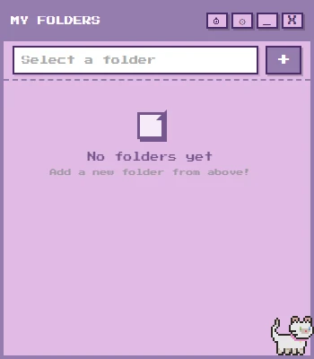

*Main application with pixel cat companion and task folders*

  

<table>
<tr>
<td width="50%">
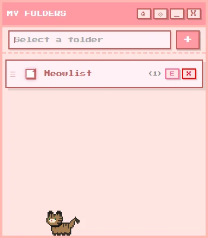

<b>9 Pixel Cat Skins</b>

</td>
<td width="50%">
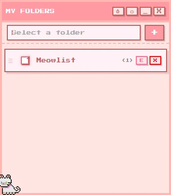

<b>9 Color Themes</b>

</td>
</tr>
<tr>
<td width="50%">
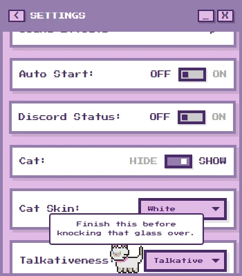

<b>Customization Options</b>

</td>
<td width="50%">
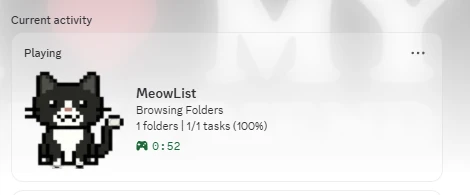

<b>Discord Integration</b>

</td>
</tr>
</table>

<b>View More Screenshots</b>

 

<table>
<tr>
<td width="33%">
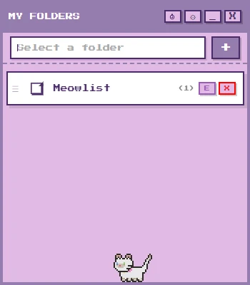

Task Management

</td>
<td width="33%">
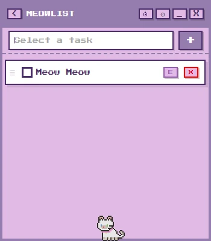

Folder Organization

</td>
<td width="33%">
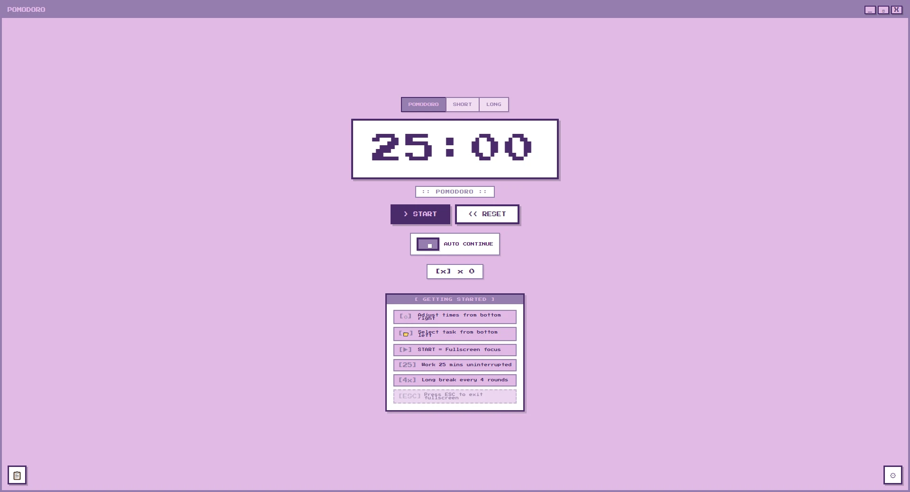

Pomodoro Timer

</td>
</tr>
<tr>
<td width="33%">
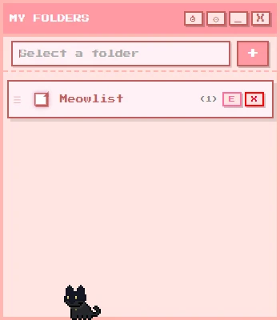

Bengal Cat

</td>
<td width="33%">
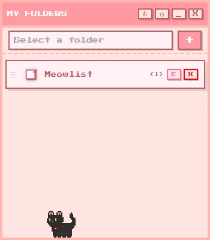

Batcat

</td>
<td width="33%">
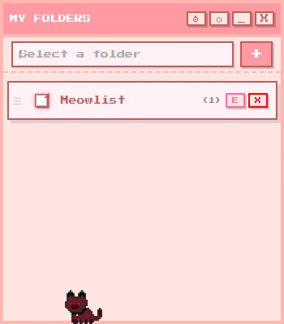

Demonic Cat

</td>
</tr>
</table>

---

## Tech Stack

| Technology | Purpose |
|------------|---------|
|  | UI component library |
|  | Type-safe development |
|  | Desktop application |
|  | Build tool and dev server |
|  | 8-bit CSS framework |
|  | Drag & drop functionality |
|  | Rich Presence integration |

---

## Performance

<table>
<tr>
<td width="33%" align="center">

Fast startup  
Low memory usage  
Smooth animations  
Small bundle size

</td>
<td width="33%" align="center">

60 FPS animations  
Auto-save system  
Instant response  
GPU acceleration

</td>
<td width="33%" align="center">

Windows 10/11  
macOS 10.15+  
Linux (AppImage)  
Web compatible

</td>
</tr>
</table>

---

## Internationalization

<table>
<tr>
<td width="50%" align="center">

🌍 Complete translation  
✅ 100% coverage  
All UI elements localized

</td>
<td width="50%" align="center">

🎨 Color customization  
✅ Full personalization  
Seamless theme switching

</td>
</tr>
</table>

---

## Contact

  

---

## License

This project is created for portfolio purposes. All rights reserved.

---

**Made with ❤️ Görkem and 🐱 by Meow Team**

*Purrfect task management with retro vibes*

 

> **Note:** This repository contains project documentation and screenshots only. Source code is private.

